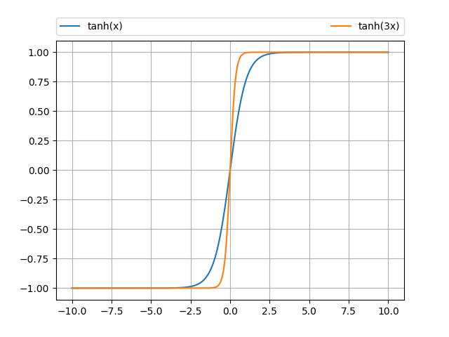

# Project : Pursuit-Evasion Robot Using ROS-Kobuki-Turtlebot
The project is done at University of Alberta (UoA) for the course CMPUT 412 : Experimental Robotics.

## Overview

The evasion robot tries to escape the pursuit robot and avoids any obstacle . The pursuit robot tries to catch the evasion robot at a safe distance. The evasion robot has the wander or random walk property. On the other hand the pursuit robot has the follower property. Both of them use the depth sensor for navigation.

## Dependencies

We tested our project on the following environment
* Ubuntu 14.04
* Python 2.7.6
* ROS Indigo
* Numpy
* Matplotlib
* OpenCV-Python 2.4.8

How to configure onboard RasberryPi for WiFI control:
Connect to a local network then connect to a Turtlebot by following the commands below
```
ssh ubuntu@192.168.2.11X #source into a Turtlebot
screen
roscore
source scripts/ROS_mater.txt #in a new screen (ctrl-a c) source to setup ROSMASTER and ROSHOSTNAME IP address
roslaunch turtlebot_bringup minimal.launch
source scripts/ROS_hostname.txt #source to complete setup of ROSMASTER and ROSHOSTNAME
roslaunch turtlebot_teleop keyboard_teleop.launch #Test with control via keyboard
```

How to configure Joy:
http://wiki.ros.org/joy/Tutorials/ConfiguringALinuxJoystick

## How to run 
### Evasion Robot
##### In Turtlebot Gazebo Simulation
```
roslaunch turtlebot_gazebo turtlebot_world.launch
cd catkin_ws
source devel/setup.bash
chmod +x fileName.py
catkin_make
rosrun packageName winder_sim.py
```
##### In Kobuki Turtlebot
```
roslaunch turtlebot_bringup minimal.launch
roslaunch turtlebot_bringup 3dsensor.launch
roslaunch turtlebot_teleop logitech.launch 
```
If joystick appears on js1 other than js0:
```
ls -l /dev/input/js1
roslaunch packageName joy.launch #refer joy.launch in project files
```
```
cd catkin_ws
source devel/setup.bash
chmod +x fileName.py
catkin_make
rosrun packageName wander.py 
```

### Pursuit Robot
##### In Turtlebot Gazebo Simulation
```
roslaunch turtlebot_gazebo turtlebot_world.launch
cd catkin_ws
source devel/setup.bash
chmod +x fileName.py
catkin_make
rosrun packageName follower_sim.py 
```
##### In Kobuki Turtlebot
```
roslaunch turtlebot_bringup minimal.launch
roslaunch turtlebot_bringup 3dsensor.launch
roslaunch turtlebot_teleop logitech.launch 
```

If joystick appears on js1 other than js0:
```
ls -l /dev/input/js1
roslaunch packageName joy.launch #refer joy.launch in project files
```
```
cd catkin_ws
source devel/setup.bash
chmod +x fileName.py
catkin_make
rosrun packageName follower_sim.py 
```

## Project Description
The evasion robot is subscribed to the "scan" topics. It checks the minimum value of the vector excluding the NaN values. If it finds something within 0.8 m it turns for a fixed time and again moves forward. If forward moving exceeds some duration it turns again. This mechanism helps it to escape from the other robot and obstacle avoidance. See the following video below.

<div align="center">
  <a href="https://www.youtube.com/watch?v=T3S_YELKO3I"></a>
</div>

The pursuit robot tries to follow the nearest object. It sees an object at a certain distance, if no object is found it drives diagonally. Whenever an object is found it maintains a safe distance. If the object tries to come close, it backs up. The proportionate behavior with respect to the error is calculated in terms of the hyperbolic function, tanh(a*error). tanh is a zero mean function, min and max values are -1 and 1 respectively. The trigonometric and hyperbolic relation is tan(ax)=atanh(x). So we multiplied the tanh(a*error) with our maximum speed for the robot's linear x direction. This velocity is bounded over any range of the error. For angular z we took the normalized position value with respect to half the scan vector(320) for a depth resolution of 640x480.

<div align="center">
  
</div>
<div align="center">
  <a href="https://www.youtube.com/watch?v=IdaIssUfn-w"></a>
</div>

## Discussion

The pursuit robot can not differentiate between a static object and a moving boject. It always follows the distance nearest to it. Hence it often gets stuck at the walls or starts following other moving ojects nearest to it. Sometimes if the evasion robot is too close it doesn't see it as the sensor readings are discarded NaN values. Velocity ramp discussed in [1] is used here.

## Future Work
The follower behavior can be improved with RGB image processing. Combining RGB-Depth and pretrained model of the shape of the robot will help to improve prcise following.

## Authors

* [Nazmus Sakib](https://github.com/nsa31)
* **Vivian**
## Acknowledgement 

* [1] [Programming Robots with ROS](https://github.com/osrf/rosbook)
* [2] [Maximum Security Bot](http://people.cornellcollege.edu/smikell15/MAX)
